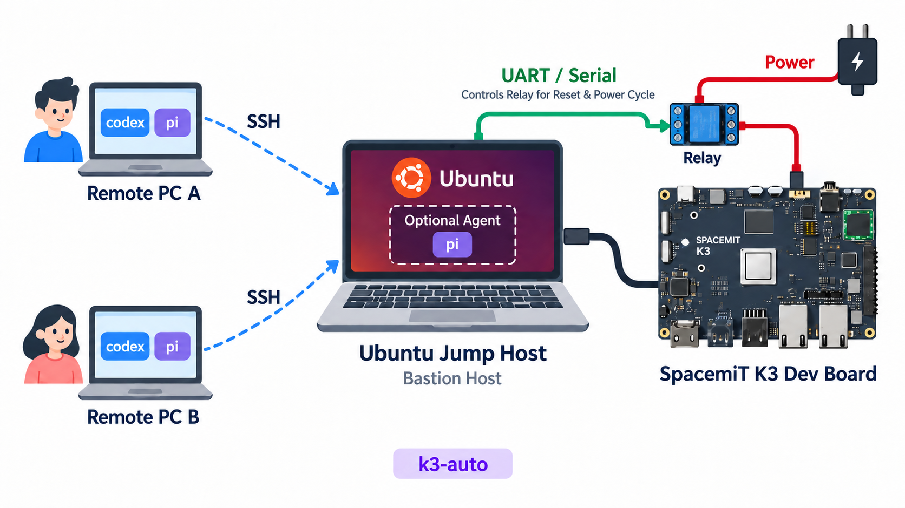

# k3-auto

Hand over the SpaceMiT K3 testing to the agent.

## Architecture



```
本地(agent) ──SSH──> 跳板机 Ubuntu Bastion Host ──UART+继电器──> SpaceMiT K3 板卡
                                                    └──有线 192.168.137.1 ──> 192.168.137.200
```

## 仓库结构

```
config/k3-auto.toml           # K3 + 局域网配置（入库）
config/k3-auto.example.toml   # 同上模板（入库）
config/jump.toml              # 跳板机 IP/账号/密码/仓库路径（不入库）
config/jump.example.toml      # 跳板机配置模板（入库，只放占位符）
scripts/k3ctl.py              # 统一 CLI：读配置，驱动跳板机/板卡
scripts/board_ssh.py          # 板卡 SSH 包装（sshpass → pexpect → 裸 ssh）
skills/k3-status/             # 只读状态探测
skills/k3-lab/                # 预检、上下电、串口、TFTP 启动、SSH 检查
skills/k3-benchmark/          # UnixBench / LMbench 编排与判定
AUTOLINK_K3_BENCHMARK_GUIDE.md # 完整手工手册（细节参考）
```

## 配置分两层（分界就是 git）

| 文件 | 内容 | 入 git |
| --- | --- | --- |
| `config/k3-auto.toml` | 板卡 IP/账号、串口设备、局域网、TFTP/日志目录、脚本名 | ✅ |
| `config/jump.toml` | 跳板机 host/port/user/password/sudo_password、仓库绝对路径 | ❌ |

解析顺序：

```
K3 配置：  --config > $K3_AUTO_CONFIG > ./config/k3-auto.toml(向上) > ~/.config/k3-auto/config.toml
跳板机：   --jump-config > $K3_JUMP_CONFIG > ./config/jump.toml(向上) > ~/.config/k3-auto/jump.toml
```

为了兼容，单文件写法（在 `k3-auto.toml` 里写 `[jump]`）仍然有效；
`jump.toml` 存在时其中同名字段优先。

## 快速开始

```bash
cp config/k3-auto.example.toml config/k3-auto.toml   # K3/局域网，通常不用改
cp config/jump.example.toml   config/jump.toml       # 填跳板机信息
$EDITOR config/jump.toml
python3 scripts/k3ctl.py show-config  # 两个配置文件路径都会打印，密码打码
python3 scripts/k3ctl.py status       # 只读看看板子状态
python3 scripts/k3ctl.py power on     # 上下电（走 sudoers NOPASSWD 绝对路径）
python3 scripts/k3ctl.py tftp-put /path/to/Image-xxx
python3 scripts/k3ctl.py unixbench Image-xxx 0909-round1-baseline --campaign baseline
python3 scripts/k3ctl.py serial-stop  # 停掉后台 minicom
python3 scripts/k3ctl.py power off
```

任何命令加 `-n/--dry-run` 只打印将要执行的远端命令。

## 已实测的关键行为

- 跳板机 SSH 用配置密码（本机 sshpass），板卡 SSH 由跳板机侧 helper 用
  pexpect 嗂密码，**不需要在跳板机装任何东西**。
- 跳板机 sudoers 的 NOPASSWD 只匹配**绝对路径**的 `k3-power.sh` /
  `k3-minicom.sh`；`k3ctl` 自动展开路径，所以上下电/串口不需要 sudo 密码。
- `tftp-put` 拷到 `/srv/tftp` 属普通 sudo，用 `[jump] sudo_password`。
- 后台串口采集必须带 pty，`k3ctl serial-log` 内部用
  `TERM=xterm setsid script -qec ... /dev/null` 实现。

## 配置解析顺序

`--config` > `$K3_AUTO_CONFIG` > `./config/k3-auto.toml`（向上查找）>
`~/.config/k3-auto/config.toml`。

## 安装 skills

Skills 位于 `skills/`。仓库内的 `.pi/settings.json` 已声明 `{"skills": ["skills"]}`，
在项目里打开 pi 即可发现。要全局可用就软链：

```bash
ln -s "$PWD/skills/k3-status"    ~/.pi/agent/skills/k3-status
ln -s "$PWD/skills/k3-lab"       ~/.pi/agent/skills/k3-lab
ln -s "$PWD/skills/k3-benchmark" ~/.pi/agent/skills/k3-benchmark
```

## 致谢

感谢 [@0bluewhale0](https://github.com/0bluewhale0) 提供 `k3-status`，该部分在此基础上可能做了部分重构。
